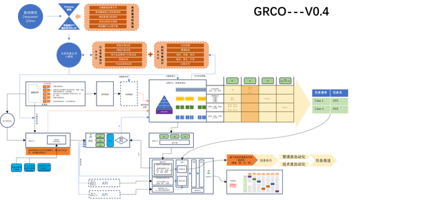

# DataSec Hub - 数据安全合规知识服务平台

<div align="center">

[](https://github.com/sermilan/hubgo/releases)
[](./LICENSE)
[](#)
[](https://react.dev/)
[](https://www.typescriptlang.org/)
[](https://tailwindcss.com/)

**面向企业的专业级数据安全合规知识服务平台**

[快速开始](./docs/QUICK_START.md) · [开发状态](./docs/DEVELOPMENT_STATUS.md) · [实施指南](./docs/IMPLEMENTATION_GUIDE.md) · [商业计划](./docs/BUSINESS_PLAN.md)

</div>

---

## 🎉 项目状态

✅ **前端完成** - 所有前端功能已完整实现，包括4大页面、11个核心模块、40+组件
✅ **后端完成** - NestJS后端已全部实现，包括认证、政策/COU/场景管理、AI集成等模块
✅ **API对接** - 前端API服务层完成，支持Mock/真实API切换
📚 **文档完善** - 提供完整的系统文档和开发指南

**当前可用功能**：
- ✅ 完整的UI/UX界面
- ✅ 所有业务流程演示
- ✅ 模拟数据支持（开发模式）
- ✅ 真实后端API（生产模式）
- ✅ 完整的API接口实现

---

## 📋 项目简介

**从何而来**



这个项目创作思路是由图片而来，数据安全行业，应该需要有一套GRCO平台，他的定位是G治理、R风险管理、C合规、O运营，运营工作由任务驱动，任务由风险和事件驱动，这些风险和事件由是治理过程的必然结果，涉及体系及合规等各个方面。

而当前市面上，这套逻辑基本是由内部治理团队或外围顾问进行人肉指导并推进落实，缺乏长期性和即时性，国内一直缺乏持续投入基础工作的务实厂商，有此认知的又想死守着做为自己的护城河，导致数据安全这么多年的发展，基本是一个停滞状态，即：十年前总结的方法论，拿到当下依然能打；一年不关注行业，也不会有任何掉队感觉。

如今，已不在此行业，但为了自己的意难平，又恰好时至今日AI能力够的上，就把自己的想法做了这个开源项目，大家共同来维护一套高效的数据安全COU数据库。

当然，眼前解决国内从无到有，下一步的**版本迭代方向是内部全智能转化；外部被AI智能体调用后，面向场景的智能合规检查**。

DataSec Hub 是一个专业的数据安全政策知识服务平台，通过创新的**COU（合规义务单元）**体系，将复杂的法律法规转化为清晰、可执行的合规要求，为企业提供：

- 📚 **全面的政策库**：覆盖国内所有数据安全相关的法律法规、标准规范
- 🎯 **COU体系**：结构化的合规义务单元，清晰明确每项要求
- 🔍 **智能检索**：关键词、多维度筛选、标签系统
- 🎨 **场景构建**：自定义合规场景，智能权重计算
- 📊 **可视化分析**：权重分布、优先级排序、统计报表
- 🔌 **API服务**：支持企业系统集成和本地大模型调用

## 🌟 核心特性

### 1. COU（合规义务单元）体系

创新的合规知识结构化方法：

```typescript
COU示例：COU-DSL-001
├── 标题：重要数据处理者应当明确数据安全负责人和管理机构
├── 来源：中华人民共和国数据安全法 第27条
├── 类型：强制性
├── 基础权重：10（法律级别）
├── 适用行业：通用
├── 要求行动：
│   ├── 1. 确定数据安全负责人
│   ├── 2. 建立数据安全管理机构
│   └── 3. 落实数据安全保护责任
├── 技术措施：[组织架构设计、责任制度]
└── 关联COU：[COU-DSL-002, COU-PIPL-015]
```

### 2. 三层权重系统

科学的优先级计算：

- **基础权重** (1-10分)
  - 法律: 10分
  - 行政法规: 9分
  - 部门规章: 8分
  - 国家标准: 7分
  - 行业标准: 6分
  - 地方性法规: 5分
  - 指南指引: 4分

- **场景权重** (动态计算)
  - 标签匹配度 × 0.5
  - 行业匹配 × 1.0
  - 区域匹配 × 0.8
  - 用户类型匹配 × 0.6

- **最终权重** = 基础权重 + 场景权重

### 3. 智能场景构建

6个预设场景模板 + 自定义场景：

- 🎮 游戏出海场景
- 🏦 金融等保场景
- 🛒 电商合规场景
- 🏥 医疗数据场景
- 🏙️ 智慧城市场景
- 📚 教育科技场景

**场景分析功能**：
- 权重分布图表
- COU优先级排序
- 合规覆盖率
- 差距分析

### 4. 完整的版本管理

解决政策更新问题：

- 📜 政策版本历史追踪
- 🔄 新旧版本对比
- ⚠️ 废止政策提醒
- 🔗 版本关联关系

### 5. 双标签系统

提高检索精度：

- 🏷️ **人工标签**：专业标注的核心标签
- 🤖 **AI标签**：自动提取的辅助标签
- 📂 标签分类：法律、技术、管理、行业、场景

## 🏗️ 系统架构

### 前端技术栈

```
React 18.3 + TypeScript 5.x
├── UI框架：Tailwind CSS 4.0
├── 组件库：Radix UI (40+ components)
├── 图标库：Lucide React
├── 通知：Sonner
├── 状态管理：React Hooks
├── 图表：Recharts
└── 构建工具：Vite 6.x
```

### 核心页面（已完成）

1. **Landing Page** - 营销着陆页
   - 产品介绍
   - 核心功能展示
   - 应用场景
   - 订阅方案对比

2. **Auth Page** - 登录注册
   - 统一认证界面
   - 支持个人/企业/院校三种类型
   - 14天免费试用

3. **Main App** - 主应用（7大模块）
   - 📊 COU浏览器
   - 📚 政策浏览器
   - 🎯 场景管理器
   - 🔧 场景构建器
   - 📈 数据看板
   - ⚙️ 用户设置
   - 📖 API文档

4. **Admin Page** - 后台管理（4大模块）
   - 📄 政策管理
   - 🎯 COU管理
   - 👥 用户管理
   - ⚙️ 系统设置

### 后端技术栈

```
NestJS 11 + TypeScript
├── 数据库：PostgreSQL 15 + TypeORM
├── 搜索引擎：Elasticsearch 8
├── 缓存：Redis 7.x
├── 认证：JWT + Passport
├── 文档：Swagger/OpenAPI
└── AI服务：支持7家国内主流AI厂商
    ├── 智谱AI (GLM)
    ├── DeepSeek
    ├── Kimi (Moonshot)
    ├── 百度文心一言
    ├── 阿里通义千问
    ├── 豆包
    └── OpenAI兼容接口
```

**已实现模块**：
- ✅ 用户认证（注册/登录/刷新Token）
- ✅ 政策管理（CRUD/筛选/统计）
- ✅ COU管理（CRUD/搜索/关联查询）
- ✅ 场景管理（CRUD/模板/克隆/版本）
- ✅ 标签系统（五维分类管理）
- ✅ 全文搜索（Elasticsearch/高亮/建议）
- ✅ AI集成（7家厂商/统一接口）
- ✅ 导入导出（CSV/JSON/Excel）
- ✅ 数据统计（系统概览/趋势分析）

## 📊 项目结构

```
hubgo/
├── src/                               # 前端源码
│   ├── app/
│   │   ├── App.tsx                    # 主应用入口
│   │   ├── pages/                     # 页面组件 (4个)
│   │   │   ├── LandingPage.tsx       # 营销页面
│   │   │   ├── AuthPage.tsx          # 登录注册
│   │   │   ├── MainApp.tsx           # 主应用
│   │   │   └── AdminPage.tsx         # 后台管理
│   │   ├── components/                # 业务组件 (60+)
│   │   │   ├── COUExplorer.tsx       # COU浏览器
│   │   │   ├── PolicyExplorer.tsx    # 政策浏览器
│   │   │   ├── SceneManager.tsx      # 场景管理器
│   │   │   ├── SceneBuilder.tsx      # 场景构建器
│   │   │   ├── Dashboard.tsx         # 数据看板
│   │   │   ├── UserSettings.tsx      # 用户设置
│   │   │   ├── admin/                # 后台管理组件
│   │   │   └── ui/                   # UI组件库 (40+)
│   │   ├── types/                    # 类型定义
│   │   ├── data/                     # 模拟数据
│   │   ├── hooks/                    # React Hooks
│   │   └── services/                 # API服务
│   ├── styles/                       # 样式文件
│   └── test/                         # 测试文件
├── backend/                           # 后端源码
│   ├── src/
│   │   ├── entities/                 # 数据库实体 (8个)
│   │   ├── modules/                  # 功能模块
│   │   │   ├── auth/                 # 认证模块
│   │   │   ├── policies/             # 政策模块
│   │   │   ├── cous/                 # COU模块
│   │   │   ├── scenes/               # 场景模块
│   │   │   ├── tags/                 # 标签模块
│   │   │   ├── search/               # 搜索模块
│   │   │   ├── ai/                   # AI集成模块
│   │   │   ├── analytics/            # 数据统计模块
│   │   │   └── import-export/        # 导入导出模块
│   │   ├── config/                   # 配置文件
│   │   └── main.ts                   # 入口文件
│   ├── test/                         # 测试文件
│   └── docker-compose.yml            # Docker配置
├── docs/                              # 文档目录 (13个)
├── .github/                           # GitHub配置
└── package.json
```

## 🚀 快速开始

### 方式一：完整启动（前后端）

```bash
# 1. 克隆项目
git clone https://github.com/sermilan/hubgo.git
cd hubgo

# 2. 启动依赖服务（PostgreSQL + Redis + Elasticsearch）
cd backend && docker-compose up -d && cd ..

# 3. 启动后端
cd backend
npm install
cp .env.example .env  # 编辑 .env 配置数据库连接
npm run start:dev &
cd ..

# 4. 启动前端
npm install
npm run dev

# 访问应用
# 前端 http://localhost:5173
# 后端 API http://localhost:3000
# API 文档 http://localhost:3000/api
```

### 方式二：仅启动前端（Mock数据模式）

如果不需要后端，可以使用Mock数据进行开发演示：

```bash
# 克隆项目
git clone https://github.com/sermilan/hubgo.git
cd hubgo

# 安装依赖
npm install

# 启动开发服务器（使用Mock数据）
npm run dev

# 访问 http://localhost:5173
```

### 方式三：查看文档

📖 **推荐阅读顺序**：

1. **[QUICK_START.md](./docs/QUICK_START.md)** - 5分钟快速了解系统
2. **[DEVELOPMENT_STATUS.md](./docs/DEVELOPMENT_STATUS.md)** - 查看完整开发状态
3. **[SYSTEM_OVERVIEW.md](./docs/SYSTEM_OVERVIEW.md)** - 理解系统架构
4. **[IMPLEMENTATION_GUIDE.md](./docs/IMPLEMENTATION_GUIDE.md)** - 开始后端开发

### 方式四：API集成

详见 [API集成指南](./docs/API_INTEGRATION_GUIDE.md)

## 📈 项目定位

### 开源免费

**DataSec Hub 是一个非商业化的开源学习项目，所有功能完全免费。**

| 功能 | 说明 |
|------|------|
| COU访问 | 无限制，开放全部合规义务单元 |
| 场景创建 | 无限制，支持自定义合规场景 |
| API调用 | 本地部署，完全自主可控 |
| 代码开源 | GPL-2.0 许可证，自由使用修改 |

### 核心特色

1. **数据资产**：结构化的数据安全政策知识库
2. **AI赋能**：7家国内主流AI厂商支持，智能提取COU
3. **开源共建**：欢迎贡献代码、文档、政策数据

详见 [项目规划](./docs/PROJECT_ROADMAP.md)

## 💡 使用场景

### 企业合规团队
快速检索相关政策，创建合规检查清单，自动化合规评估

### 法务团队
查阅最新法律法规，生成政策解读，制作咨询报告

### 产品经理
了解合规要求，将合规纳入产品设计，避免后期整改

### 技术团队
集成API到业务系统，自动化合规检查，生成合规报告

### 咨询公司
为客户提供专业合规服务，管理多个项目，批量分析

## 🎯 核心创新

### 1. AI赋能COU沉淀

**7家国内主流AI厂商统一接入**：
- 🤖 **智能COU提取**：AI自动从政策文本中提取合规义务单元
- 🏷️ **智能标签推荐**：自动为COU打上技术、管理、法律标签
- 🔗 **智能关联分析**：发现COU之间的隐含关联关系
- 📊 **权重智能评估**：结合上下文智能评估合规重要性

**支持的AI厂商**：智谱AI、DeepSeek、Kimi、百度文心、阿里通义、豆包、OpenAI兼容接口

### 2. COU体系
- 将复杂法律条款转化为结构化合规义务
- 清晰的行动指引和适用范围
- 科学的权重评估系统
- 支持AI辅助批量生成和优化

### 3. 智能场景
- 基于标签和权重的智能匹配
- 实时权重计算
- 可视化分析报告
- AI驱动的场景推荐

### 4. 版本管理
- 完整的政策版本追踪
- 自动关联新旧版本
- 及时的变更提醒
- AI辅助变更影响分析

## 📚 学习资源

- [快速开始指南](/QUICK_START.md) - 5分钟上手
- [开发状态报告](/DEVELOPMENT_STATUS.md) - 了解项目进度
- [系统概述](/SYSTEM_OVERVIEW.md) - 理解系统架构
- [实施指南](/IMPLEMENTATION_GUIDE.md) - 后端开发指南
- [API集成指南](/API_INTEGRATION_GUIDE.md) - API使用说明
- [项目规划](/PROJECT_ROADMAP.md) - 项目发展路线图和AI赋能规划

## 🔧 开发者指南

### 前端开发（已完成）

所有前端功能已完整实现：
- ✅ 4个核心页面
- ✅ 11个业务模块
- ✅ 60+ 业务组件 + 40+ UI组件
- ✅ 完整的类型系统
- ✅ API服务层（支持Mock/真实API切换）

**启动前端**：
```bash
# 安装依赖
npm install

# 启动开发服务器
npm run dev

# 访问 http://localhost:5173
```

### 后端开发（已完成）

完整的 NestJS 后端实现，详见 [实施指南](./docs/IMPLEMENTATION_GUIDE.md)

**核心功能**：
- ✅ JWT认证（注册/登录/刷新Token）
- ✅ 政策管理（CRUD/筛选/统计/导入导出）
- ✅ COU管理（CRUD/搜索/关联查询）
- ✅ 场景管理（CRUD/模板/克隆/版本控制）
- ✅ 标签系统（五维分类管理）
- ✅ 全文搜索（Elasticsearch/高亮/搜索建议）
- ✅ AI集成（7家国内主流AI厂商统一接口）
- ✅ 数据统计（系统概览/趋势分析/用户行为）

**启动后端**：
```bash
cd backend

# 安装依赖
npm install

# 配置环境变量（复制示例文件并修改）
cp .env.example .env

# 启动开发服务器
npm run start:dev

# 访问 http://localhost:3000
# API文档 http://localhost:3000/api
```

**使用Docker启动依赖服务**：
```bash
cd backend

# 启动 PostgreSQL + Redis + Elasticsearch
docker-compose up -d
```

## 🤝 贡献

我们欢迎各种形式的贡献！请查看 [CONTRIBUTING.md](./CONTRIBUTING.md) 了解如何参与。

## 📝 许可证

本项目采用 GPL-2.0 许可证 - 详见 [LICENSE](./LICENSE) 文件。

## 🙏 致谢

- [shadcn/ui](https://ui.shadcn.com/) - UI 组件库
- [Radix UI](https://www.radix-ui.com/) - Headless UI 基础组件
- [Tailwind CSS](https://tailwindcss.com/) - 实用优先 CSS 框架

---

<div align="center">

**DataSec Hub - 让数据合规更简单**

Made with ❤️ by DataSec Team

**当前版本**: v1.0.0 | **最后更新**: 2025-03-19

</div>
